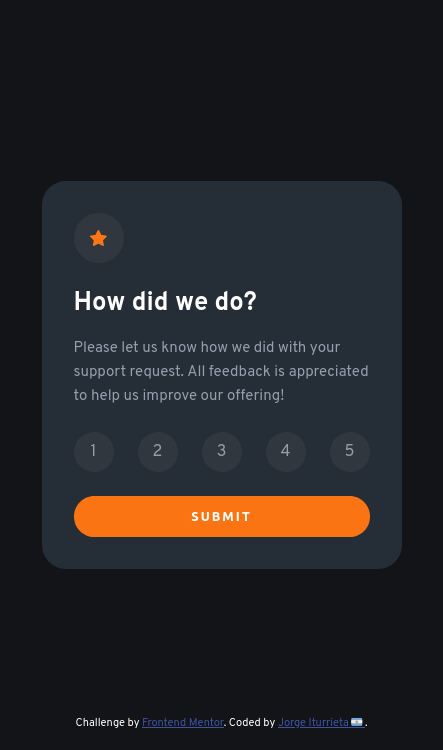

# Frontend Mentor - Interactive rating component solution

This is a solution to the [Interactive rating component challenge on Frontend Mentor](https://www.frontendmentor.io/challenges/interactive-rating-component-koxpeBUmI). Frontend Mentor challenges help you improve your coding skills by building realistic projects.

## Table of contents

-   [Overview](#overview)
    -   [The challenge](#the-challenge)
    -   [Screenshot](#screenshot)
    -   [Links](#links)
-   [My process](#my-process)
    -   [Built with](#built-with)
    -   [What I learned](#what-i-learned)
-   [Author](#author)

## Overview

### The challenge

Users should be able to:

-   View the optimal layout for the app depending on their device's screen size
-   See hover states for all interactive elements on the page
-   Select and submit a number rating
-   See the "Thank you" card state after submitting a rating

### Screenshot

### Links
-   Solution URL: [codepen](https://codepen.io/jiturrieta/pen/qBpxzNO)
-   Github Respository: [GITHUB REPOSITORY](https://github.com/JorgeIturrieta/interactive-rating-component)
-   Live Site URL: [LIVE SOLUTION](https://jorgeiturrieta.github.io/interactive-rating-component/)

## My process

### Built with

-   Semantic HTML5 markup
-   CSS custom properties
-   Flexbox
-   Mobile-first workflow
-   Vanila JavaScript

### What I learned

I usually work with React Js but in this project i preferred work with Vanilla JS to to reaffirm forgotten knowledge like event Manipulation and render html code with JS.

## Author

-   Frontend Mentor - [@yourusername](https://www.frontendmentor.io/profile/JorgeIturrieta)
